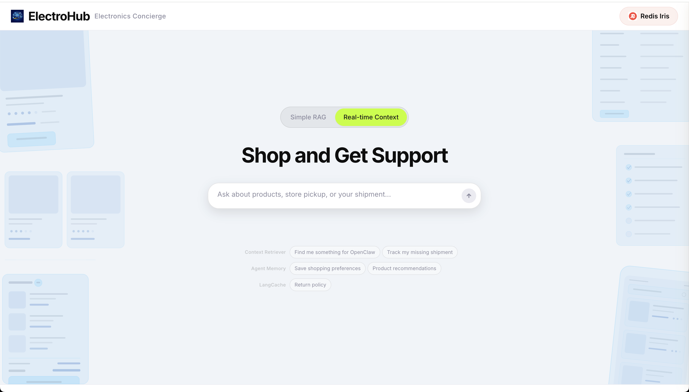
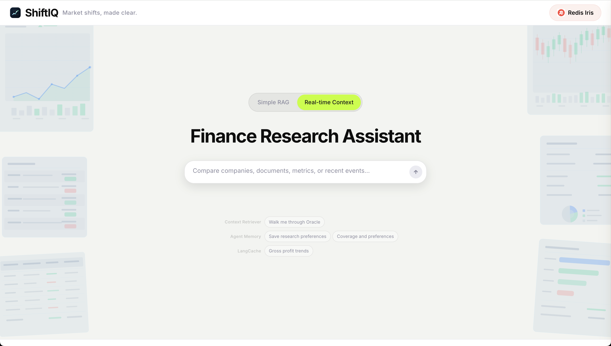
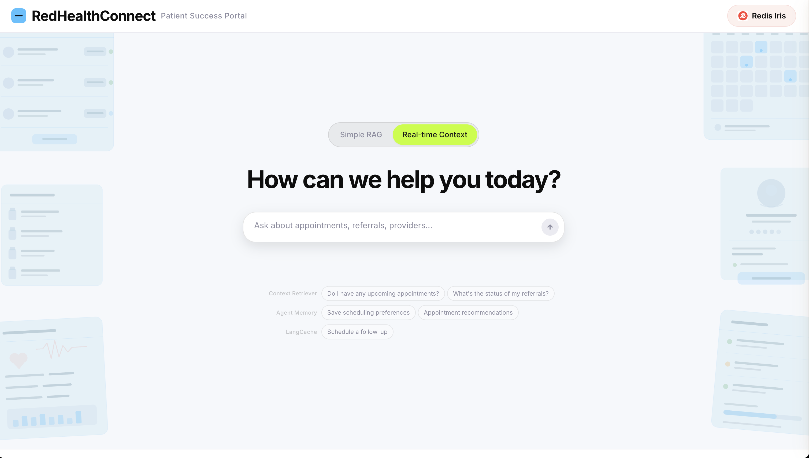
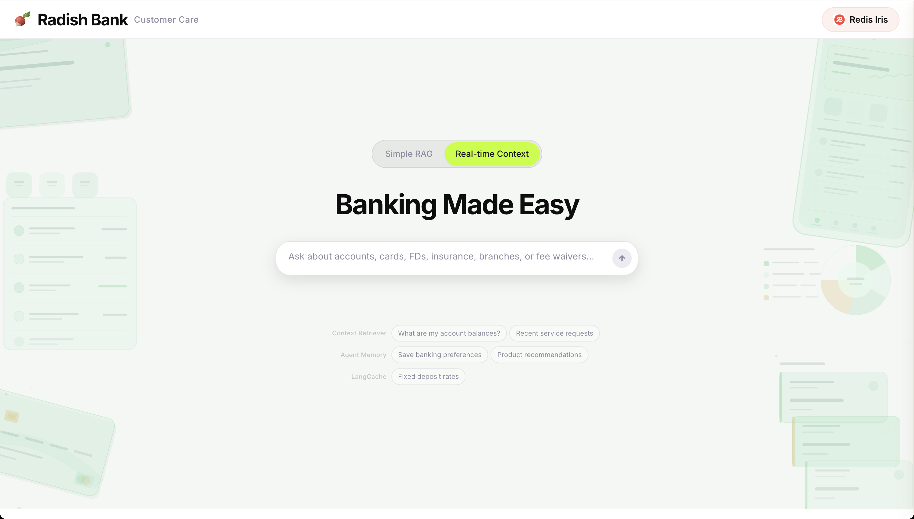

<div align="center">

# Redis Iris Demos

**Reusable demo apps powered by Redis Iris**

Multi-domain AI agent demos for [Redis Iris](https://redis.io/iris/): Redis's unified context engine for AI agents.

Every domain runs Context Retriever, Agent Memory, LangCache, and Semantic Routign.
</div>

---
## Iris Components in Demo

| Solution | What it does |
|--------|-------------|
| **Semantic Routing** | Blocks off-topic queries before they reach the LLM |
| **LangCache** | Returns cached responses for semantically similar questions |
| **Agent Memory** | Enriches prompts with short-term session context + long-term user knowledge |
| **Context Retriever** | Give agents clean, schema-first paths through all business data |

## Domains

| Industry | App | Screenshot |
|----------|-----|------------|
| Food delivery | Redis Eats |  |
| Electronics retail | ElectroHub |  |
| Financial research | ShiftIQ |  |
| Healthcare | RedHealthConnect |  |
| Retail banking | Radish Bank |  |
| Wireless telecom | R-Mobile | — |

## Legacy

The `legacy/context-engine-demos/` directory contains an archived copy of the original `redis/context-engine-demos` repository — the first-generation demo that showcased Context Retriever only. The current repo supersedes it with Semantic Routing, LangCache, Agent Memory, and domain-specific branding.


## Getting Started

### Prerequisites

- Python 3.11+
- Node.js 18+
- [uv](https://docs.astral.sh/uv/) (Python package manager)

### Redis Cloud services needed

| Service | What you need |
|---------|--------------|
| Redis database | Host, port, password |
| [Context Surfaces](https://redis.io/docs/latest/develop/ai/context-engine/context-retriever/) | Admin key |
| [Agent Memory](https://redis.io/docs/latest/develop/ai/context-engine/agent-memory/) | Base URL, store ID, API key |
| [LangCache](https://redis.io/docs/latest/develop/ai/context-engine/langcache/) | Host, cache ID, API key |
| OpenAI | [API key](https://platform.openai.com/api-keys) |

### First time

```bash
make install                      # Install Python + JS dependencies
cp .env.example .env              # Fill in credentials
make setup                        # Generate data, load Redis, seed memory + cache
make dev                          # Start at localhost:3040
```

### Coming back (same domain)

```bash
make dev                          # Data persists in Redis
```

If the agent has no tools (Redis was flushed, instance recycled), reload:

```bash
make reset                        # Reload data + re-seed
make dev
```

### Switching domains


```bash
 # Update the DEMO_DOMAIN in .env
make setup      
make dev
```


## What `make setup` does

1. Sets `DEMO_DOMAIN` in `.env`
2. Generates Context Surface models from the domain schema
3. Generates synthetic data (JSONL files)
4. Flushes Redis database
5. Creates a new Context Surface (writes `CTX_SURFACE_ID` + `MCP_AGENT_KEY` to `.env`)
6. Loads data into Redis (creates search indexes)
7. Seeds Agent Memory (clears existing, seeds 2 long-term memories per domain)
8. Seeds LangCache (flushes cache, seeds 1 cached response per domain)
9. Semantic Routing initializes automatically when the server starts

`make reset` does steps 4-9 only (faster — reuses existing models and data files).

## Creating a New Domain

Adding a new vertical (e.g., telecom, travel, insurance). Every domain follows the same structure, so the process is repeatable.

### What you need to create

| File | What goes in it |
|------|----------------|
| `domains/<id>/schema.py` | Redis data entities (customers, orders, products, etc.) |
| `domains/<id>/domain.py` | Manifest: branding, theme, guardrail routes, seed memories, seed cache |
| `domains/<id>/prompt.py` | Agent system prompt with tool hints and workflows |
| `domains/<id>/data_generator.py` | Synthetic demo data (realistic names, amounts, scenarios) |
| `domains/<id>/assets/logo.svg` | Domain logo (renders at 28x28 in the topbar) |
| `domains/<id>/docs/demo_paths.md` | 2-4 scripted demo conversation paths |
| `frontend/public/backgrounds/<id>/left.svg` | Landing page left illustration (~590x817, <35KB) |
| `frontend/public/backgrounds/<id>/right.svg` | Landing page right illustration (~632x817, <35KB) |

Each domain implements the `DomainPack` protocol defined in `backend/app/core/domain_contract.py`.

### Using AI to create a domain

The fastest way to create a new vertical is with an AI coding assistant. Detailed authoring skills are available for both:

- **Claude Code**: `.claude/skills/domain-pack-authoring.md`
- **Codex**: `.codex/skills/domain-pack-authoring/SKILL.md`

Just ask: *"Create a new domain for [your vertical]"* — the skill guides the agent through the full process: entity design, branding, realistic guardrail routes, seed data, prompts, and demo scenarios.

## Project Structure

```
backend/
  app/
    main.py                  # FastAPI app, SSE streaming, 7-phase pipeline
    langgraph_agent.py       # LangGraph ReAct agent
    memory_service.py        # Redis Agent Memory client
    context_surface_service.py  # MCP tool wrapper
    guardrail_service.py     # Semantic routing guardrail
    langcache_service.py     # Semantic cache client
    settings.py              # Pydantic BaseSettings
    core/
      domain_contract.py     # DomainPack protocol + configs
      domain_schema.py       # EntitySpec definition

domains/
  reddash/                   # Food delivery
  electrohub/                # Electronics retail
  finance-researcher/        # Financial research
  healthcare/                # Patient portal
  radish-bank/               # Retail banking
  rmobile/                   # Wireless telecom

frontend/
  src/
    App.tsx                  # React chat UI, SSE handler
    components/              # ConversationView, ActivityPanel, EmptyState

scripts/                     # Setup, data loading, seeding, validation

.codex/skills/
  domain-pack-authoring/     # AI skill for creating new domains
```

## Make Targets

| Target | What it does |
|--------|-------------|
| `make domains` | List available domains |
| `make setup [DOMAIN=X]` | Full setup: models, data, Redis, seed |
| `make reset` | Reload current domain into Redis + re-seed |
| `make dev` | Start backend (:8040) + frontend (:3040) |
| `make install` | Install Python + JS dependencies |
| `make create-domain DOMAIN=X` | Scaffold a new domain |
| `make seed-memories` | Re-seed long-term memories for current domain |
| `make seed-langcache` | Re-seed LangCache entries for current domain |
| `make flush-redis` | Wipe Redis database |

All targets read `DEMO_DOMAIN` from `.env` — no need to pass `DOMAIN=` unless switching.

---

## License

MIT